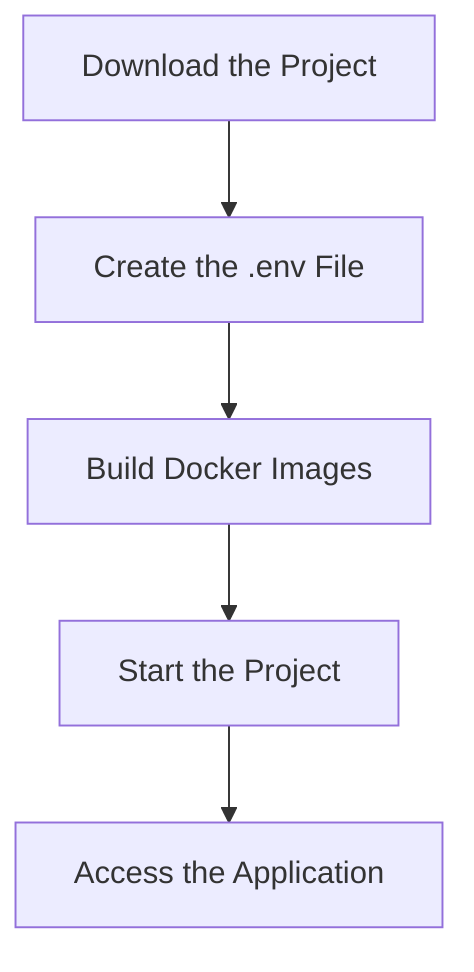

# EAIE_T
This repository was created for Taniguchi Lab's Exercises in Applied Information Engineering.

# Daily Picture Diary

This application, developed in this project, allows users to upload images and automatically generates diary titles and content using AI. Users can create, edit, and view diaries, which are displayed in a 3D book format.

## Environment Setup Instructions

### 1. Download the Project

First, clone the project from GitHub.

```bash
git clone https://github.com/RiCoDeKu/EAIE_T.git
cd EAIE_T
```
<mark>If you have already downloaded this project locally, you do not need to follow these instructions.</mark>

### 2. Create a .env File

Create a `.env` file in the root directory of the project and include the following content. This project uses `gpt-4o-mini`, so ensure you obtain and configure your OpenAI API key in the `.env` file.

```env
COMPOSE_PROJECT_NAME=eaie_t_server

DB_ENGINE=django.db.backends.postgresql
DB_NAME=postgres
DB_USER=postgres
POSTGRES_PASSWORD=postgres-password
DB_HOST=postgres
DB_PORT=5432

DJANGO_SECRET_KEY="your-django-secret-key"

DJANGO_CORS_ALLOWED_ORIGINS="
http://localhost:3000,
http://localhost:5173,
http://localhost:5174,
http://localhost:9000,
http://localhost:8000"

OPENAI_API_KEY=your-openai-api-key
```

### 3. Start the Project

Use the `Makefile` to start the project (Docker images will be created automatically).

```bash
cd server
make dev
```

This will start both the backend (Django) and the frontend (React).

### 4. Access the Application

Open your browser and navigate to the following URL:

<http://localhost:5173/>

### Environment Setup Flow



## Notes
- Ensure you configure `your-django-secret-key` and `your-openai-api-key` in the `.env` file according to your environment.
- Verify that Docker and Make are installed on your system.
- Adjust the `docker-compose` settings as needed.
- Please note that using OpenAI's `gpt-4o-mini` requires purchasing API credits.

## Contact
For questions or issues related to the project, please contact us via GitHub Issues.
