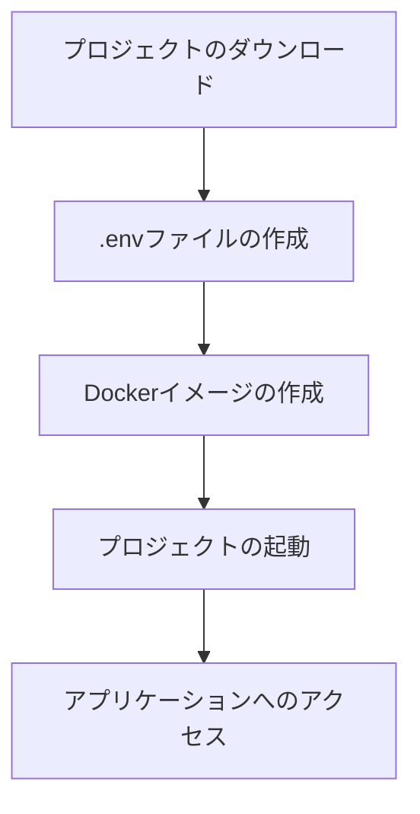

# EAIE_T
This repository was created for Taniguchi Lab's Exercises in Applied Information Engineering.

# 毎日の絵日記プロジェクト

このプロジェクトは、画像をアップロードし、AIを使用して日記のタイトルと内容を自動生成するWebアプリケーションです。ユーザーは日記を作成、編集、閲覧することができ、3Dの本の形で日記を表示することができます。

## 環境構築手順

### 1. プロジェクトのダウンロード

まず、GitHubからプロジェクトをクローンします。

```bash
git clone https://github.com/your-username/your-repo-name.git
cd your-repo-name
```

### 2. .envファイルの作成

プロジェクトのルートディレクトリに `.env` ファイルを作成し、以下の内容を記述します。特に、OpenAI APIキーを取得し、設定してください。

```env
COMPOSE_PROJECT_NAME=eaie_t_server

DB_ENGINE=django.db.backends.postgresql
DB_NAME=postgres
DB_USER=postgres
POSTGRES_PASSWORD=postgres-password
DB_HOST=postgres
DB_PORT=5432

DJANGO_SECRET_KEY="your-django-secret-key"

DJANGO_CORS_ALLOWED_ORIGINS="
http://localhost:3000,
http://localhost:5173,
http://localhost:5174,
http://localhost:9000,
http://localhost:8000"

OPENAI_API_KEY=your-openai-api-key
```

### 3. プロジェクトの起動

`Makefile` を使用してプロジェクトを起動します（Dockerイメージは自動的に作成されます）。

```bash
cd server
make dev
```

これにより、バックエンド（Django）とフロントエンド（React）が起動します。

### 4. アプリケーションへのアクセス

ブラウザを開き、以下のURLにアクセスします。

```
http://localhost:5173/
```

### 環境構築フロー



## 注意事項
- `.env` ファイル内の `your-django-secret-key` と `your-openai-api-key` は必ず自分の環境に合わせて設定してください。
- DockerおよびMakeがインストールされていることを確認してください。
- 必要に応じて `docker-compose` の設定を調整してください。

## 問い合わせ
プロジェクトに関する質問や問題が発生した場合は、GitHubのIssueを通じてお問い合わせください。
